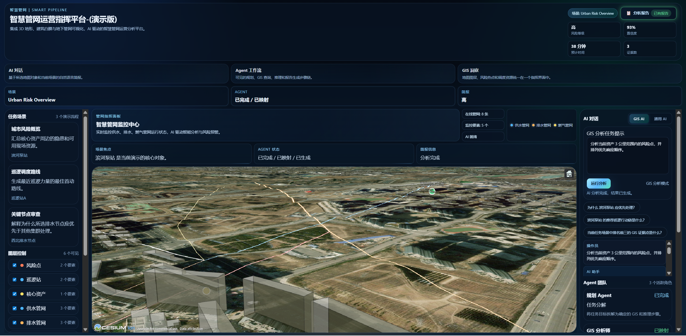
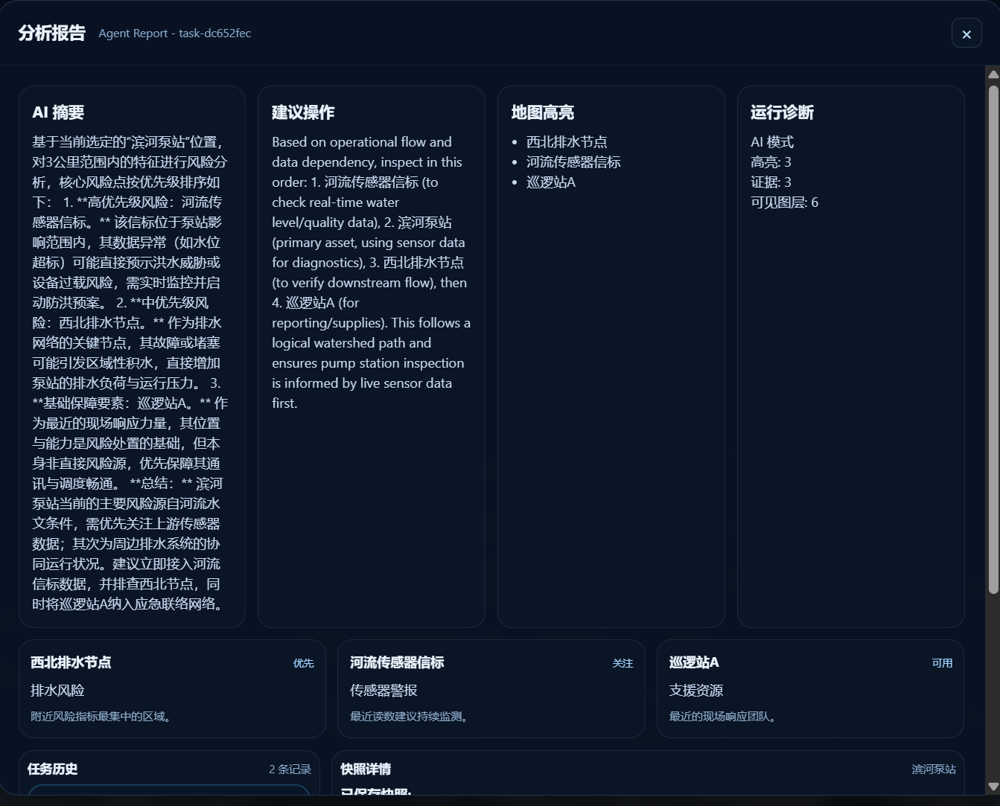

# Multi-Agent GIS Analysis Platform

[](https://vuejs.org/)
[](https://spring.io/projects/spring-boot)
[](https://cesium.com/)
[](https://www.typescriptlang.org/)
[](https://openjdk.org/)
[](LICENSE)

> AI-powered 3D smart pipeline visualization and operations analysis platform with GIS spatial queries, Cesium World Terrain, building white models, and underground pipe network glow effects.

[中文文档](README.zh-CN.md)

## Highlights

- **3D Terrain + Building White Models** — Cesium World Terrain + OSM Buildings translucent white rendering
- **Underground Pipe Network** — Water supply, drainage, and gas pipelines with glow effects, visible through buildings (X-ray mode)
- **GIS AI Analysis** — Click any map feature, AI automatically analyzes nearby risk points and generates structured reports
- **General AI Chat** — Switch to free-form conversation mode with AI
- **Multi-Agent Workflow** — Planner, GIS Analyst, and Report Agent collaborate in sequence
- **Task History** — Analysis results auto-saved with snapshot replay

## Screenshots

| 3D Pipeline Visualization |
|:-------------------------:
|  |
| *3D terrain, buildings, underground pipe network with glow* |

| AI Analysis Result |
|:------------------:|
|  |
| *GIS AI analysis report and risk assessment* |

## Architecture

```
┌──────────────────────────────────────────────────────┐
│  Frontend (Vue 3 + Vite + TypeScript + CesiumJS)     │
│  3D Map · Pipe Rendering · AI Chat Panel · Reports   │
└───────────────────────┬──────────────────────────────┘
                        │ HTTP REST
                        ▼
┌──────────────────────────────────────────────────────┐
│  Backend (Spring Boot 3.4 + Java 17)                 │
│  Agent Orchestrator · AI Gateway · GIS Query · Report│
└───────┬─────────────────────────────────┬────────────┘
        │                                 │
        ▼                                 ▼
┌──────────────────┐          ┌───────────────────────┐
│ PostgreSQL       │          │ Anthropic API         │
│ + PostGIS        │          │ (Mimo-compatible)     │
│ (optional, mock  │          │ Natural language      │
│  fallback)       │          │ generation only       │
└──────────────────┘          └───────────────────────┘
```

**Key insight:** Spatial analysis (proximity queries, risk assessment, evidence building) is done in the Java backend. AI only receives structured context as text prompt and generates natural language summaries.

## Quick Start

### Frontend

```bash
cd frontend
npm install
npm run dev
# Open http://localhost:5173
```

### Backend

```bash
cd backend
# Optional: set AI API key (mock mode if not set)
export AI_API_KEY="your-api-key"
export AI_BASE_URL="https://api.anthropic.com"

./gradlew bootRun
# Backend at http://localhost:8081
```

### Docker (Full Stack)

```bash
cp .env.example .env
# Edit .env with your API key
docker-compose up --build
# Open http://localhost
```

## Tech Stack

| Layer | Technology |
|-------|-----------|
| Frontend | Vue 3, Vite, TypeScript, Pinia, CesiumJS |
| Backend | Spring Boot 3.4, Java 17, Gradle |
| Database | PostgreSQL + PostGIS (optional, mock fallback) |
| AI | Anthropic API (Mimo-compatible provider) |
| Deployment | Docker Compose, Nginx reverse proxy |

## Project Structure

```
├── frontend/                # Vue 3 + Cesium frontend
│   ├── src/
│   │   ├── components/      # MapCanvas — 3D map component
│   │   ├── composables/     # usePipeNetwork — pipe glow rendering
│   │   ├── config/          # Cesium Ion token config
│   │   ├── data/            # Mock spatial + pipe data
│   │   ├── services/        # API client (axios)
│   │   ├── stores/          # Pinia state management
│   │   └── views/           # Main workbench view
│   └── Dockerfile
├── backend/                 # Spring Boot backend
│   └── src/main/java/.../
│       ├── agent/           # Task orchestration
│       ├── ai/              # AI gateway (Anthropic API)
│       ├── api/             # REST controllers
│       ├── gis/             # Spatial query service
│       └── report/          # Report generation
│   └── Dockerfile
├── docs/                    # Documentation
├── mock-data/               # GeoJSON sample data
└── docker-compose.yml
```

## AI Analysis Flow

```
User clicks map feature → Frontend sends feature name
  → Backend queries nearby GIS features (PostGIS or mock)
  → Builds prompt: "User selected X, nearby: Y, Z. Analyze..."
  → Sends to Anthropic API → Returns natural language
  → Assembles response with risk level, evidence, highlights
  → Frontend renders result on map + report panel
```

See [docs/AI_Explain.md](docs/AI_Explain.md) for detailed breakdown.

## Environment Variables

| Variable | Description | Default |
|----------|-------------|---------|
| `AI_API_KEY` | Anthropic API key | empty (mock mode) |
| `AI_BASE_URL` | API endpoint | `https://api.anthropic.com` |
| `AI_MODEL` | Model name | `claude-sonnet-4-20250514` |
| `AI_MAX_TOKENS` | Max output tokens | `1024` |
| `VITE_CESIUM_ION_TOKEN` | Cesium Ion access token | built-in default |

## Documentation

- [System Architecture](docs/system-architecture.md)
- [AI Analysis Flow](docs/AI_Explain.md)
- [Local Run Guide](docs/local-run-guide.md)
- [Deployment Runbook](docs/deployment-runbook.md)

## License

[MIT](LICENSE)
